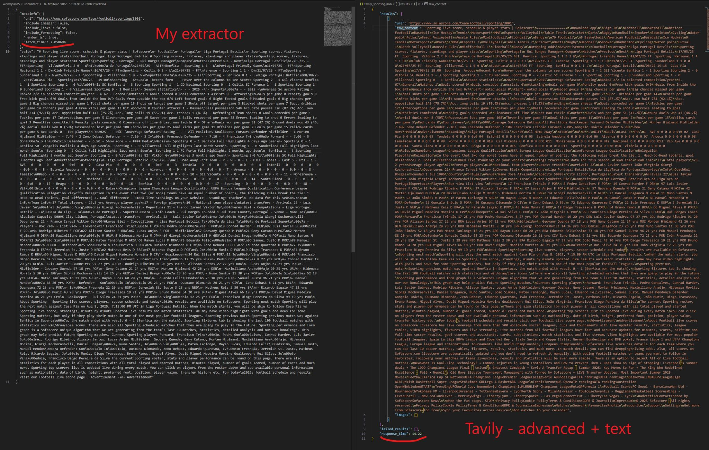

Screenshots comparing (top): My extractor versus Tavily with basic mode - quite bad. (bottom) My extractor versus Tavily with advanced mode - in par but 2x slower.

---
> *Extended from original post on [LinkedIn](https://www.linkedin.com/posts/tiagrib_what-have-you-been-using-to-scrape-url-content-activity-7358212796255285248-HwLM).*
---

What have you been using to scrape URL content so it can be fed into your RAG?\
I've been using `selenium` **+** `beautifulsoup` but had to try various alternatives and made plenty of tweaks before it worked well. \
It's one thing to scrape a simple html page, and another to scrape a heavy javascript-rendered website with ajax code that requires scrolling through the page to allow content to actually appear.\
I even tried [Tavily](https://www.tavily.com/) which seems to be the commercial go-to solution for this.\
But it didn't really do better than my code, plus, and more significantly, it's an extra cost to add to my AI agent pipeline, when this isn't even a GPU-intensive task.

I also tried [Crawl4AI](https://github.com/unclecode/crawl4ai) which provides LLM-ready web crawling and scraping, however, it is quite heavy-weight in terms of dependencies, seems to want to do much more than simple scraping, and is also not as fast as I would like it to be.

In the screenshots above you can see an example where I want to find the results of the latest *Benfica*'s matches so that I can add them into the context of an LLM. \
I tried comparing it to Tavily but unfortunately I seems to have some caching bugs and it doesn't allow me to re-run in advanced mode after I've scrated it once in basic mode.\
I had to run it on *Sporting* to try to capture more content and that worked but also added more trash plus WOW it takes about the double of the time of my code.\
Was quite surprised at how challenging this seemingly simple problem can be.

There seem to be plenty of python libs to help with web scraping but still none that can just go straight to the point:
- fetch it **efficiently**
- in a **structured** way
- in an **LLM-ready** way
- without having to add a bunch of **additional code**.

The "best" paid service seems quite below the bar.\
This is something clearly missing from Web 4.0.\
Now that we're sure we'll be using AI agents, we need a better way for **agents to communicate with live web content** that doesn't require downloading huge chunks of styling JS/html or even running OCR on it to retrieve their structure.

That may mean having every single http server to provide some **AI gateway** that can be separately authorised **and tracked** and even provide **referrals** for any advertising campaigns currently going on.

I believe **advertising/referral** is the main reason why many websites are trying to block AI scrapers.

Blocking is just a very lame approach where instead we should be integrating and allowing the markets to flourish.

It's been known and commented that many AI chatbots are picking up brands and products and *mentioning* them to users in their conversation, thanks to Google SEO that also lists them when the bot searches the web. \
But what happens to **referrals** then?

This really seems like a **big empty space** that needs to be filled in.

